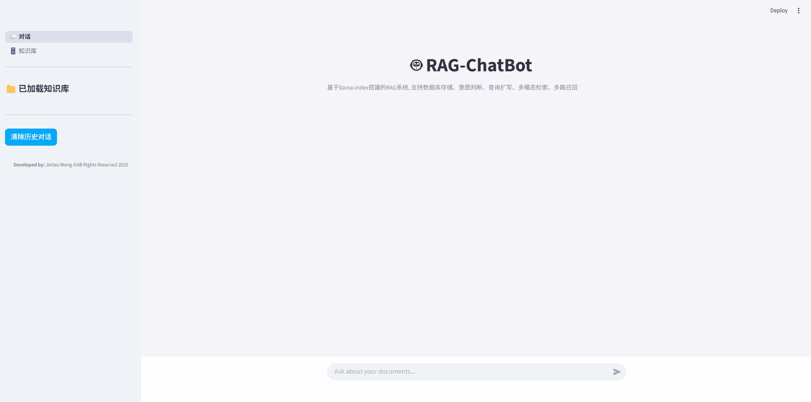

# RAG-ChatBot
## 项目简介
本项目基于llama-index实现了一个RAG的范例, 用多路召回+重排序的方案搭建, 作为作者阶段性学习成果的输出.

### 亮点
* 支持图片+文本多模态召回
* llm/embedding/rerank都用[阿里云百炼](https://bailian.console.aliyun.com)API实现, 无需部署成本

## 实现方案
1. 文档解析
   * 图文分离策略, 字部分转换为markdown格式, 图片表格通过ocr方式识别单独存储.
2. 语料库搭建: 将文档切分为多个段落. 构建向量检索语料库和字面检索语料库
    * 文档切分: 固定长度结合标点符号分块策略进行分段
    * 语义检索: 文本模态做向量嵌入时用百炼的text-embedding-v4嵌入模型; 多模态向量嵌入时文字和图片都用百炼的multimodal-embedding-v1嵌入模型, 需要保证文本和图片在同一向量空间下
    * 字面检索: 不用数据库时直接对文本用bm25算法就能实现; 用数据库时考虑到和语义检索形式统一, 用稀疏向量模拟字面检索, 那么语义检索和字面检索可以用同一套数据库
    * 数据库存储: 考虑到milvus向量数据库在实际生产环境中也会用到, 本项目语义向量和字面向量都用milvus存储. 简单点也可以用chromadb, 或者字面检索存储也可以用elasticsearch实现
3. 问题解析: 查询扩展和意图识别, 用子问题拆分和hyde等策略进行查询扩展, 训练模型识别问题对应类型的文档进行精确查询
    * 子问题拆分: 用llm对用户问句进行子问题拆分, 再对子问题进行召回, 提高检索准确率
    * 假设嵌入(HyDE): 用llm的先验知识对用户问句生成假设文档, 用假设文档进行召回, 提高检索准确率
    * 意图识别(未实现): 考虑预训练一个识别网络, 用于判断问句的意图是属于哪几类特定的文档, 提高检索准确率
4. 多路召回排序: 在向量检索语料库和字面检索语料库中分别用查询扩展后的问句及相关预设答案进行查询召回
    * 在语义检索库和字面检索库下分别对原始问句/子问题/HyDE结果进行召回, 获取多路召回结果
    * 用百炼的gte-rerank-v2重排序模型对多路召回结果进行重排序, 生成最终的问答上下文文档
5. 答案生成
    * 用百炼的qwen-plus模型结合原始问句和重排序的结果, 生成最终答案
6. 前端页面
    * 参考[DeepSeek-RAG-Chatbot](https://github.com/SaiAkhil066/DeepSeek-RAG-Chatbot)项目, 用streamlit搭建

## 当前不足
* 意图识别组件还未实现
* 多模态重排序还未支持文本和图片同时重排, gte-retank-v2重排模型仅支持文本
* 文档切分策略有待根据特定的文档类型优化, 如论文等需要支持公式完整切分
* 目前仅支持pdf/markdown文档解析

## 后续计划
* 目前正在学习grpo方法, 考虑微调一个bert模型用于识别不同文档类型
* 寻找能支持多模态向量重排的方法, 完善重排逻辑