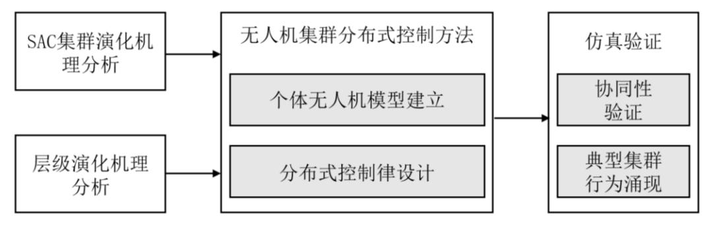
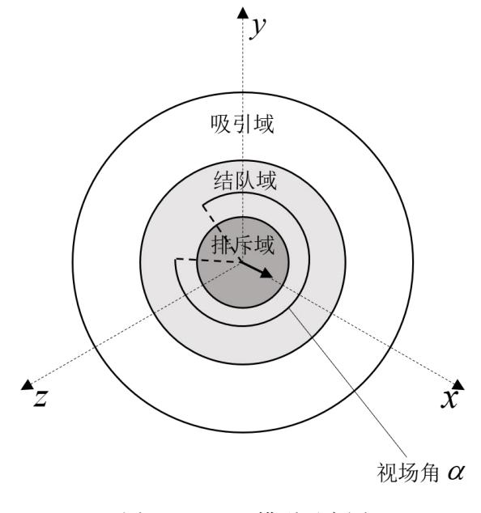

## 第2章 基于仿生机理的无人机集群协同控制

## 2.1 引言

研究无人机集群的态势感知问题时,首要任务在于构建集群运动场景,为后续的 研究提供必要的数据支撑。本文的研究对象为基于仿生机理的无人机集群,通过模拟 生物群体的演化规律,可以实现组织规模较大的无人机集群进行协同演化。

本章在分离、对齐和凝聚三条经典集群演化规则的基础上,引入自然界生物集群 中常见的层级结构,实现了只需要引导领导者运动就可以使集群涌现出不同典型集群 行为的效果。与此同时,本章建立了无人机集群协同演化控制的框架,上层为基于仿 生机理的分布式控制方法,下层为基于预线性化的个体控制方法。并通过仿真验证了 所设计的方法的有效性,能够控制集群演化展现出结队、旋涡和蜂拥等典型的集群行 为。在后续的内容中,将以典型集群行为为重要依据,对集群态势进行分析。本章的 内容安排主要如图 [2-1](#page-0-0) 所示。

图 2-1 集群协同控制整体研究框架

## 2.2 SAC 集群演化机理

在集群行为研究领域,有一些经典著作对群体行为的基本准则进行了深入讨论。 1987 年,Reynolds 提出了一套被称为分离-对齐-凝聚(Separation-Alignment-Cohesion, SAC)规则的经典理论[\[26\]](#page--1-0)。SAC 规则是对自然界中大多数群体生物演化规则的抽象描 述,是仿生集群行为研究领域的基本准则。

另有一些学者,匈牙利物理学家 Vicsek 从统计物理学的角度研究了集群行为中的 聚类和相变现象。Vicsek 模型通常应用于描述动物群体(如鱼群、鸟群)或人造群体 (如无人机、机器人)的运动模式,模型中涉及到许多重要概念,如群体动力学、相 变现象和自组织行为等。

在 Vicsek 的模型中,每个个体被建模为一个简单的粒子,具有速度和方向。个体 之间通过感知邻近的个体来调整自己的运动方向,从而产生集群行为。具体来说,个 体的运动收到两个因素影响:与邻近个体的平均方向趋同和随机扰动。个体倾向于与 周围个体保持一致的运动方向,同时收到一定程度的随机性影响。

$$
x_i(t+1) = x_i(t) + v \begin{bmatrix} \cos(\theta_i(t)) \\ \sin(\theta_i(t)) \end{bmatrix}
$$
 (2-1)

$$
\theta_i(t+1) = \arctan(\frac{\sum_{j \in N_i(t)} \sin(\theta_j(t))}{\sum_{j \in N_i(t)} \cos(\theta_j(t))}) + \Delta \theta
$$
\n(2-2)

式中,() *i x t*表示个体*i*在*t*时刻的位置,*v*表示速度大小,()*it*表示个体*i*在*t*时刻的方 向角度, *N t i* ()表示个体*i*在时刻*t*的邻居集合,表示随机噪声。个体被建模为一阶 积分器,系统状态为个体位置 () *i x t* ,系统输入为运动方向()*it* 。运动方向由邻近个体 的平均方向和随机扰动决定。每个个体倾向于调整自己的运动方向,使其与周围邻 近个体的平均方向一致;而随机扰动使得群体内的个体不会完全保持一致的运动方向, 增加了系统的多样性和鲁棒性

Vicsek 模型仅仅以速度平均的方式试图解释为何群体行为会呈现出一致性。然而, 仅仅使得集群速度达到一致是远远不够的。不管是在生物界中还是现实应用中,研究 者们不仅希望集群能够协同运动,更希望集群能够展现出高度的"智慧",能够以一些 特定的行为去完成某些任务。Iain Couzin 从生物集群的角度出发,以 SAC 规则为基础, 提出了一种新的集群运动模型,其中个体之间的互动被分为三个环形区域,分别是吸 引、结对和排斥,通过不同区域内的不同交互规则,这模型成功地再现了鱼群的蜂拥 和结队等复杂行为模式。

Couzin 模型由物理学家 Iain Couzin 提出,这个模型旨在研究群体中个体之间的相 互作用如何导致整体的群体运动行为。个体通过感知周围邻近个体的位置和运动方向 来调整自己的运动行为。与 Vicsek 模型不同的是,Couzin 模型中考虑了更多个体间的 社会交互规则,如排斥、结队和吸引等规则,如图 [2-2](#page-1-0) 所示。

图 2-2 Couzin 模型示意图

Couzin 模型中个体的运动规律由一系列简单的规则和方程组成,其中个体的运动 规则为:

$$
v_i(t) = d_i(t) + \eta \tag{2-3}
$$

$$
r_i(t+1) = r_i(t) + v_i(t)s\Delta t \tag{2-4}
$$

式中, *v t i* ( ) 表示个体 *i* 在*t*时刻的速度方向, *d t i* ( ) 为根据规则计算的速度方向,为随 机噪声,*r t i* ()表示个体 *i* 在*t*时刻的位置,*s*表示个体的速度大小,*t*为仿真步长。

Couzin 模型同样将个体建模为一阶积分器模型,系统状态为个体位置()*irt*,系统 输入为速度方向()*ivt* 。个体的速度分为速度大小*s*和速度方向*vi*(*t*),其中速度大小*s*为设定值,速度方向()*ivt*由期望速度方向 ( ) *i d t* 和随机噪声扰动生成。期望速度方向( ) *i d t*由吸引、结队和吸引三条数学规则合成。Couzin 模型描述的三条规则分别为:

规则一,吸引,个体倾向于朝向个体聚集多的方向运动;

规则二,结队,个体倾向于朝向邻居个体平均运动方向运动;

规则三,排斥,个体倾向于避开邻近个体,防止碰撞;

这三条规则分别对应的数学模型为:

$$
d_{i,a}(t+1) = \sum_{j}^{n_r} \frac{r_{ij}(t)}{|r_{ij}(t)|}
$$
\n(2-5)

$$
d_{i,o}(t+1) = \sum_{j \neq i}^{n_o} \frac{\nu_j(t)}{|\nu_j(t)|}
$$
 (2-6)

$$
d_{i,r}(t+1) = -\sum_{j \neq i}^{n_a} \frac{r_{ij}(t)}{|r_{ij}(t)|}
$$
 (2-7)

式中, , ( 1) *i r d t* + 表示个体*i*在排斥规则下的速度方向分量,*rn*表示排斥区域内邻居个体 的数量,*rtccijji*()=为个体*i*与*j*之间的相对位置,*ic*和 *j c* 分别表示个体*i*和*j*的位置;(1)*iodt*+表示个体*i*在结队规则下的速度方向分量,*on*表示结队区域内邻居个体的数量,*j v*为个体*j*的速度;( 1) *i a d t* +表示个体*i*在吸引规则下的速度方向分量,*an*为吸引区域 内邻居个体的数量。Couzin 模型在 Vicsek 模型的基础上进行了拓展,引入了个体之间 的排斥和吸引,同时为集群模型的建立提供了有效的基础框架,方便后续的集群研究 在此基础上进行调整和扩展。

根据吸引、结队和排斥三种基础规则得到的期望速度方向分量分别为*dia*, 、 *dio*, 、*dir*,。三条规则中,排斥规则的优先级最高,即优先保证集群中的个体不发生碰撞。吸 引和结队规则的优先级同等,通过调整吸引和结队规则的参数,能够调整集群中个体 的运动状态,使得集群的运动行为更加协调。Couzin 模型的提出,为学者们解释自然 界的集群效应提供了一个理论框架,同时 Couzin 模型也为设计和控制无人机群体以及 其它自组织系统奠定了理论基础。通过这些简单的规则,Couzin 模型能够模拟出一系 列复杂的群体运动行为,如昆虫的蜂拥运动、鸟类的结队飞行等,如图 [2-3](#page--1-0) 所示。