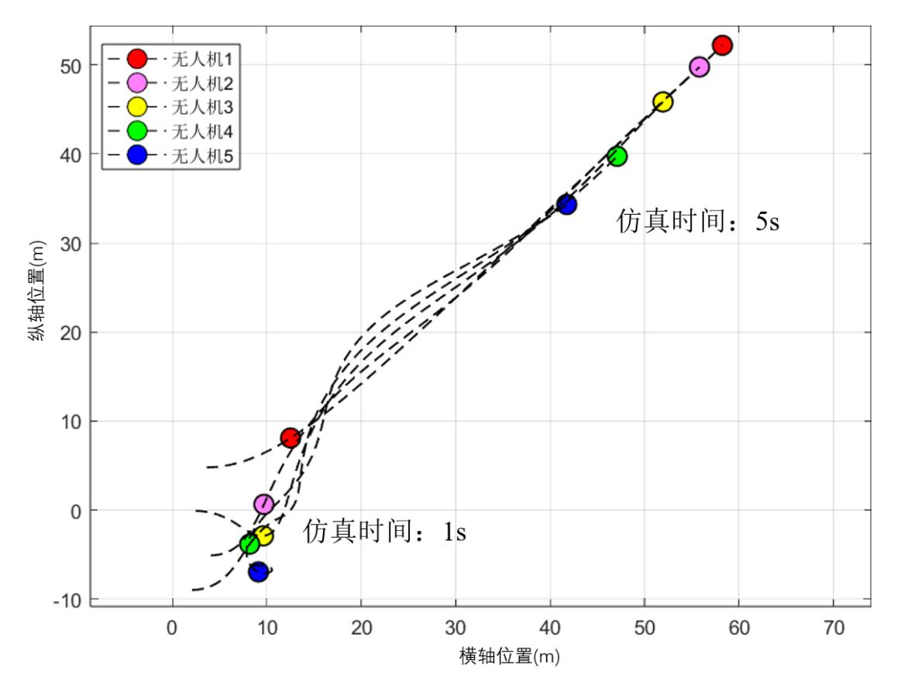
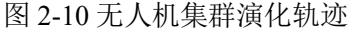
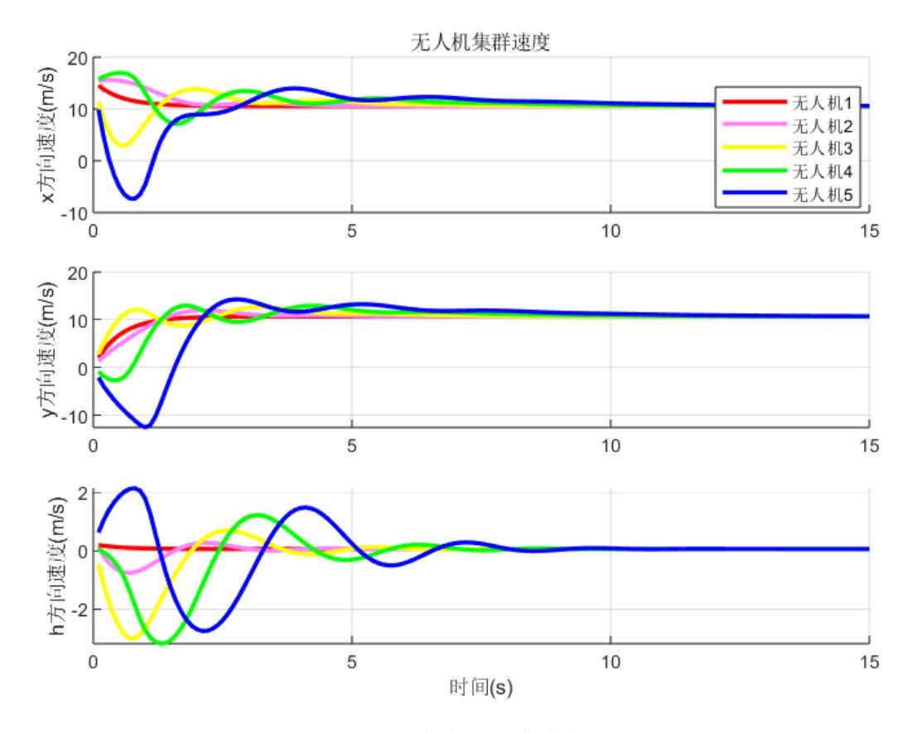
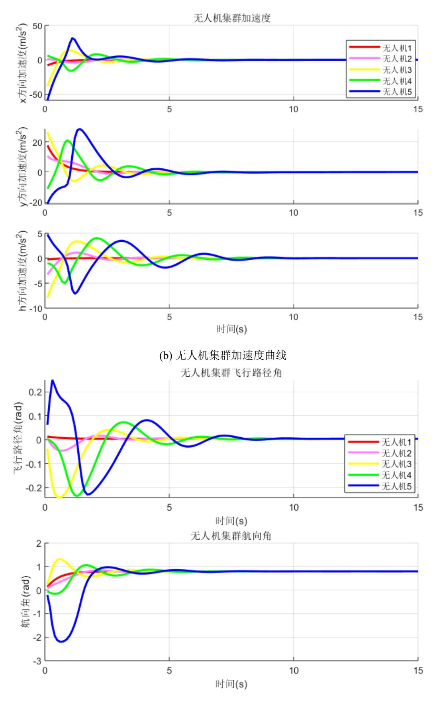

## 2.5 仿真验证

本节中进行了一系列仿真,对本章中设计的无人机集群控制方法和典型集群行为 进行了验证。首先验证了本章中提出的无人机集群演化控制方法的有效性,对集群的 协同效应和避障效果进行了演示说明。然后引导集群,实现了结队、旋涡和蜂拥三种 典型集群行为的涌现,为后续态势分析提供了基础。本章仿真中使用到的参数[\[78\]](#page--1-0)[如表](#page-0-0) [2-1](#page-0-0) 和表 [2-2](#page-0-1) 所示:

| 参数                            | 符号                                  | 数值     |
|-------------------------------|-------------------------------------|--------|
| 个体无人机质量( kg )           | m                                   | 20     |
| 2 最大侧向过载( ) kg m/ | n max                            | 5      |
| 爬升和滑行速度( ) s/ m      | [ , ]   min max | [-5,5] |
| 速度区间( ) s/ m         | [ ] v v min , max | [5,15] |
| 2 重力加速度( ) kg m/  | g                                   | 9.81   |
| 2 机翼面积( ) m          | A area                           | 1.37   |
| 风速( ) s/ m           | v m                              | 4      |
| 3 大气密度( ) kg m/   |                                    | 1.225  |
| 阻力系数                          | k d                              | 0.1    |
| 负载效率系数                        | k n                              | 1      |
| 零升力阻力系数                       | CD0                                 | 0.02   |
| 表 2-2                      | 仿生演化算法参数                            |        |
| 参数                            | 符号                                  | 数值     |
|                               |                                     |        |

表 2-1 无人机动力学参数

| 表 仿生演化算法参数 2-2  |        |     |  |
|-----------------------|--------|-----|--|
| 参数                    | 符号     | 数值  |  |
| 排斥域距离阈值( ) m    | d s | 3   |  |
| 聚集域距离阈值( ) m    | d c | 10  |  |
| 避障距离阈值( ) m     | d o | 5   |  |
| 参考速度( ) s/ m | ref v  | 10  |  |
| 排斥力权重                 |  s | 0.5 |  |
| 结队力权重                 |  a | 1.0 |  |
| 聚集力权重                 |  c | 0.6 |  |
| 避障力权重                 |  o | 0.8 |  |

首先验证无人机集群演化控制方法的协同效应,对一个由5架无人机组成的集群进 行了仿真测试。初始状态中,无人机个体随机分布在一个边长为 20m 的正方形区域内, 高度分布 20±10m 的范围内。仿真结果如图 [2-10](#page--1-0) 和图 [2-11](#page--1-0) 所示,集群由初始的随机分 布状态演化为仿羊群行为的列状协同运动状态。图 [2-10](#page--1-0) 中,不同颜色的圆点表示不同 的无人机个体,虚线表示集群中个体的运动轨迹。

(a) 无人机集群速度曲线

图 2-11 无人机集群速度、加速度和角度等状态的时间响应